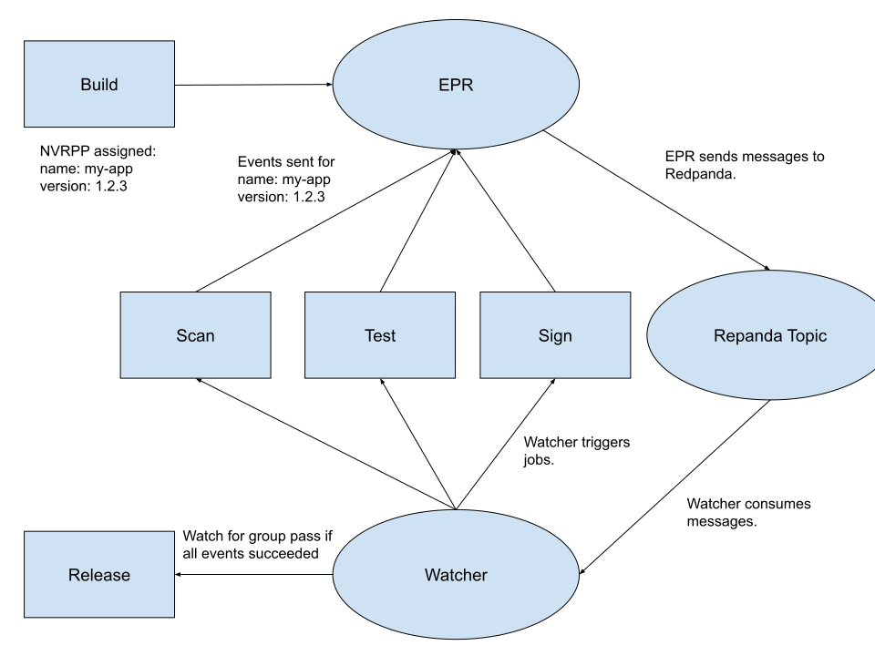

# Announcing the Event Provenance Registry (EPR) Open Source Project

[Event Provenance Registry](https://github.com/sassoftware/event-provenance-registry)
is a culmination of several years of [SAS's](https://www.sas.com) effort to
convert from large-ship events to CI/CD. We built the first version internally
to facilitate CI/CD in a complex, aging build system. The result enables SAS to
build, package, scan, promote, and ship thousands of artifacts daily.

## Origin

Around mid-2019, our R&D needed to move faster to stay competitive. SAS's
software release process to that point consisted of two or three large-ship
events per year. Updates were slow and often painful. To reverse that trend, we
needed to find a way to shorten the development cycle and deliver artifacts more
quickly. The challenge was twofold:

- First, create a system that could allow disparate pieces of our pipeline to
  communicate and chain together.
- Second, help R&D shift gears from the old software development model to CI/CD.

In a happy, imaginary world somewhere, we could have chained together GitHub
actions, or equivalent, into a working pipeline. No need to write EPR at all.
Reality was not so kind. Our source code was (and still is) spread across
several different source management systems. Few of them had the fancy built in
CI/CD features we all know and love. Further complicating matters, our build
system is old. Some parts of it are older than I am. SAS also delivers most of
its software rather than hosting it as a service. Not only do we have to support
the latest version, but also other supported versions we've shipped to
customers. To confront our myriad of problems. We needed an ecosystem agnostic
solution that was simple enough to work anywhere.

Our solution was Event Provenance Registry, or rather, the precursor to it. We
compared it to duct taping a Raspberry Pi to a tractor. EPR is the glue that
enabled the rest of the pipeline to really take off.

## How it works

EPR is simple in its operation but requires some explanation. At a high level,
EPR collects events based on tasks done by the pipeline and sends them to a
message queue. Other services that we call "watchers" monitor the message queue
and act when they see events of interest. EPR can gate events by certain
criteria as well. EPR supports Redpanda and Kafka as message queues. For the
examples below, I will assume we're using Redpanda.

To facilitate event collection, EPR has three data structures of note: events,
event-receivers, and event-receiver-groups. I will also refer to the latter two
as "receivers" and "groups" respectively for brevity.

### NVRPP

NVRPP is an unpronounceable acronym that you'll need to be familiar with to
understand how EPR works. It stands for:

- Name
- Version
- Release
- Package
- Platform ID

Each of these fields is just a string, though we strongly recommend you impose
some standards for how each is formatted, depending on your situation. NVRPP is
based off the
[NEVRA](https://docs.fedoraproject.org/en-US/modularity/core-concepts/nsvca/)
from Fedora. It allows us to represent most types of artifacts that might flow
through our pipeline. Events that have matching NVRPPs are associated with the
same artifact. This allows us to trace the flow of any artifact through our
pipeline, so long as events are posted at each step.

### Event Receivers

Event receivers are data structures stored within EPR that represent some kind
of action (i.e., a build, running a test, packaging an artifact, deploying a
binary, etc...) with no dependencies and are classified by their name, type, and
version. You might name a receiver by the action it represents like
golang-build-complete. Types are arbitrary, but work better with a
comprehensible structure. Enter
the [CD Events spec](https://github.com/cdevents/spec). This spec provides a
standard on which to build interoperability between CI/CD systems. The following
examples take advantage of CD Events.

Receivers may have multiple [events](#events) that correspond
with them. Any events associated with a receiver must have a `payload` that
complies with the schema defined on the receiver. This allows some guarantees
about what kind of data you can expect of events going to any given receiver.
The receiver defined below requires a CD Event schema for any incoming events.

```json
{
  "name": "artifact-packaged",
  "type": "dev.cdevents.artifact.packaged.0.1.1",
  "version": "1.0.0",
  "description": "CDEvents Artifact Packaged",
  "enabled": true,
  "schema": {
    "$schema": "https://json-schema.org/draft/2020-12/schema",
    "$id": "https://cdevents.dev/0.4.0-draft/schema/artifact-packaged-event",
    "properties": {
      "context": {
        "properties": {
          "version": {
            "type": "string",
            "minLength": 1
          },
          "id": {
            "type": "string",
            "minLength": 1
          },
          "source": {
            "type": "string",
            "minLength": 1,
            "format": "uri-reference"
          },
          "type": {
            "type": "string",
            "enum": [
              "dev.cdevents.artifact.packaged.0.1.1"
            ],
            "default": "dev.cdevents.artifact.packaged.0.1.1"
          },
          "timestamp": {
            "type": "string",
            "format": "date-time"
          }
        },
        "additionalProperties": false,
        "type": "object",
        "required": [
          "version",
          "id",
          "source",
          "type",
          "timestamp"
        ]
      },
      "subject": {
        "properties": {
          "id": {
            "type": "string",
            "minLength": 1
          },
          "source": {
            "type": "string",
            "minLength": 1,
            "format": "uri-reference"
          },
          "type": {
            "type": "string",
            "minLength": 1,
            "enum": [
              "artifact"
            ],
            "default": "artifact"
          },
          "content": {
            "properties": {
              "change": {
                "properties": {
                  "id": {
                    "type": "string",
                    "minLength": 1
                  },
                  "source": {
                    "type": "string",
                    "minLength": 1,
                    "format": "uri-reference"
                  }
                },
                "additionalProperties": false,
                "type": "object",
                "required": [
                  "id"
                ]
              }
            },
            "additionalProperties": false,
            "type": "object",
            "required": [
              "change"
            ]
          }
        },
        "additionalProperties": false,
        "type": "object",
        "required": [
          "id",
          "type",
          "content"
        ]
      },
      "customData": {
        "oneOf": [
          {
            "type": "object"
          },
          {
            "type": "string",
            "contentEncoding": "base64"
          }
        ]
      },
      "customDataContentType": {
        "type": "string"
      }
    },
    "additionalProperties": false,
    "type": "object",
    "required": [
      "context",
      "subject"
    ]
  }
}
```

When an event posts to a receiver, EPR will emit a message to Redpanda.

### Events

Events are a record of some action that took place in your pipeline and whether
it was successful. Each event contains an [NVRPP](#nvrpp) and is linked to a
receiver by way of an ID. Events that have matching NVRPPs are associated with
the same artifact. This allows us to trace the flow of any artifact through our
pipeline, so long as events are posted at each step. Events are strictly
formatted at the root level, with a free-form JSON `payload` field that is
validated against the schema of its receiver. Each event contains a Boolean
`success` field that represents whether an action was successful or not.

When EPR receives an event, it posts a message and some receiver and group data
to Redpanda. Downstream watchers can then consume these messages and take their
own actions. A common use case is watchers matching messages based on the
`success` field of an event (and by extension, the message). This allows you to
take different actions depending on if an event passed or failed. For example,
you could open a ticket against a team if their event to the `artifact.scanned`
type receiver had `success=false`. If we post an event for the receiver above,
it might look something like this:

```json
{
  "name": "foo",
  "version": "1.0.1",
  "release": "2023.11.16",
  "platform_id": "aarch64-gnu-linux-7",
  "package": "oci",
  "description": "packaged oci image foo",
  "payload": {
    "context": {
      "version": "0.4.0-draft",
      "id": "271069a8-fc18-44f1-b38f-9d70a1695819",
      "source": "/event/source/123",
      "type": "dev.cdevents.artifact.packaged.0.1.1",
      "timestamp": "2023-03-20T14:27:05.315384Z"
    },
    "subject": {
      "id": "pkg:golang/mygit.com/myorg/myapp@234fd47e07d1004f0aed9c",
      "source": "/event/source/123",
      "type": "artifact",
      "content": {
        "change": {
          "id": "myChange123",
          "source": "my-git.example/an-org/a-repo"
        }
      }
    }
  },
  "success": true,
  "event_receiver_id": "01HQK4JD53RYX04HZTMTEYBDTX"
}
```

### Event Receiver Groups

Event receiver groups can be thought of as gates that control whether an
artifact advances through the pipeline. Each group comprises multiple receivers.
Like receivers, groups can cause the generation of Redpanda messages. However,
they only do this if each receiver has an event with a matching NVRPP where
`success=true`. Since there may be multiple events of varying successes per
receiver, only the most recent is considered. This allows you to run many tasks
in parallel, but only advance your artifact through the pipeline once all its
tasks have completed successfully. Groups don't match exactly with the CD Event
spec, but we'll still use the same event types for our example. Normally, we
will define more than one receiver ID per group. This example is for simplicity.

```json
{
  "name": "release-checks",
  "type": "dev.cdevents.artifact.published.0.3.0-draft",
  "version": "3.3.3",
  "description": "Send an event to release our application if all pipeline tasks have passed.",
  "enabled": true,
  "event_receiver_ids": [
    "01JBX00KBSWSKPPQXQSRWRK93F"
  ]
}
```

### Watchers

Watchers are applications (typically microservices) that watch the EPR Redpanda
topic for messages and then take some action. They use some matching logic,
defined in EPR's SDK (Software Development Kit) to determine which messages to
process. You can match on NVRPP, `type`, and `success`. We've written about a
dozen or so watchers internally that do a variety of things. One of our more
popular watchers’ fires webhooks if matching criteria are met. It is most often
used to trigger Jenkins jobs, acting as glue between Jenkins and other systems.
Another popular watcher is one that creates Jira tickets when messages are
matched. We use this one heavily as part of our security automation to open
security issues against various teams when problems are detected.

The full content of messages watchers look for are similar to this:

```json
{
  "success": true,
  "id": "01JBX0GZ4VE1RZB53C37R65Q8Q",
  "specversion": "1.0",
  "type": "dev.cdevents.artifact.packaged.0.1.1",
  "source": "epr",
  "api_version": "v1",
  "name": "foo",
  "version": "1.0.1",
  "release": "2023.11.16",
  "platform_id": "aarch64-gnu-linux-7",
  "package": "oci",
  "data": {
    "events": [
      {
        "id": "01JBX0GZ4VE1RZB53C37R65Q8Q",
        "name": "foo",
        "version": "1.0.1",
        "release": "2023.11.16",
        "platform_id": "aarch64-gnu-linux-7",
        "package": "oci",
        "description": "packaged oci image foo",
        "payload": {
          "context": {
            "version": "0.4.0-draft",
            "id": "271069a8-fc18-44f1-b38f-9d70a1695819",
            "source": "/event/source/123",
            "type": "dev.cdevents.artifact.packaged.0.1.1",
            "timestamp": "2023-03-20T14:27:05.315384Z"
          },
          "subject": {
            "id": "pkg:golang/mygit.com/myorg/myapp@234fd47e07d1004f0aed9c",
            "source": "/event/source/123",
            "type": "artifact",
            "content": {
              "change": {
                "id": "myChange123",
                "source": "my-git.example/an-org/a-repo"
              }
            }
          }
        },
        "success": true,
        "created_at": "2024-11-04T20:55:13.180102-05:00",
        "event_receiver_id": "01JBX00KBSWSKPPQXQSRWRK93F",
        "EventReceiver": {
          "id": "01JBX00KBSWSKPPQXQSRWRK93F",
          "name": "artifact-packaged",
          "type": "dev.cdevents.artifact.packaged.0.1.1",
          "version": "1.0.0",
          "description": "CDEvents Artifact Packaged",
          "schema": {
            // "schema omitted for brevity"
          },
          "fingerprint": "ce507df4dc8dac35a365f720d540fd1be29fc8639e173a69804443ab4430aae8",
          "created_at": "2024-11-04T20:46:16.826009-05:00"
        }
      }
    ],
    "event_receivers": [
      {
        "id": "01JBX00KBSWSKPPQXQSRWRK93F",
        "name": "artifact-packaged",
        "type": "dev.cdevents.artifact.packaged.0.1.1",
        "version": "1.0.0",
        "description": "CDEvents Artifact Packaged",
        "schema": {
          // "schema omitted for brevity"
        },
        "fingerprint": "ce507df4dc8dac35a365f720d540fd1be29fc8639e173a69804443ab4430aae8",
        "created_at": "2024-11-04T20:46:16.826009-05:00"
      }
    ],
    "event_receiver_groups": null
  }
}
```

## Running EPR in Production

Now that you understand the basics, here's a real-world example. We'll be
starting with a build of the fabulous `my-app` application. At the end of the
build process, the build automation will post a passing event to EPR. The build
automation generates an NVRPP which will be used by the first and subsequent
events for this artifact. Downstream watchers consume the successful build
message on the Redpanda topic, triggering a security scan, integration tests,
and artifact signing. Watchers for each of those tasks invoke them with the
NVRPP used in the build event. These three tasks post more events to their
corresponding receivers that are all contained inside a release group. Once
those three receivers have passing events for the NVRPP, the group triggers a
release message, that a downstream watcher catches to release the software.



## Pitfalls

EPR was, and is, a successful project internally. That doesn't mean we didn't
have problems. These are a few issues we ran into that you can hopefully avoid.

### Lack of Access Control for Receivers and Groups

The first problem we ran into was the lack of restrictions on who could use
receivers and groups. This meant that anyone could post passing events to any
receiver, which in turn could trigger any associated groups. Add some lazy
message matching, and suddenly you find yourself releasing thousands of
artifacts without intending to (yes, this happened). We discussed adding serious
Role Based Access Control (RBAC) to receivers and groups but decided not to in
favor of development speed. Now that EPR is open sourced, we intend to implement
a more robust solution soon.

### Difficult Adoption

Once we did the hard work of writing EPR, getting the rest of the company to
adopt our fancy new tool should have been easy, right? Wrong! People don't like
change and developers are no different. We discovered that developers especially
don't like being handed a box of virtual Lego bricks and told "use th ese tools
to integrate with EPR." Many developers prefer to live in a world where they
don't need to worry about the intricacies of DevOps in addition to their normal
work. To get them to adopt it, we had to make it as minimally intrusive as
possible. The average developer has no idea how EPR works, and they prefer to
keep it that way. That was the mindset we had to combat. Forcing people to learn
new technology tends to make them complain, which leads to management pushback.
For a smooth transition, make sure you have management backing you and make it
easy for people to adopt your technology. The battle is as much political as
technical.

### Lazy Receiver Schemas

In the interest of speed, a great many people, ourselves included, formed the
habit of filling out our receivers with empty JSON schemas. While perfectly
valid by EPR standards, this type of lazy schema validation set us up for some
nasty problems later. There are many cases where we started running analytics on
events sent to a particular receiver. A good example is processing security scan
results stored in the event. The problem is that without a schema to validate
the event contents, nothing prevents a user from posting complete garbage to
your receiver. Empty schemas are fine for development, but not so great in
production.

### Inconsistent Event Types

When we started, there were, and still are, no standard event types. Users are
largely left to determine their own event types. This can lead to confusion
where events for two separate groups mean the same thing but are named
differently. CD Events would have been useful in solving this problem had we
known about it at the time. Consistent messaging makes it much easier to tell
what's going on, especially when disparate groups produce millions of events.

## Benefits

It wasn't all doom and gloom. We saw massive improvements in several key areas.

### Greatly Improved Automated Testing

One of the biggest improvements EPR allowed was the mass automation of our
integration test suite. SAS ships dozens of microservices that need to be tested
together. Our test automation team leveraged EPR to control microservice
deployments and test result collection. Using event receiver groups, they gate
the promotion of artifacts based on test results.

### Automated Software Promotions

Going hand in hand with testing are automated promotions. Like many other
companies, SAS divides its artifacts into different promotion levels (
dev/test/prod) based on their ship readiness. We wrote a watcher to handle
artifact promotion based on event receiver group completion. We can ensure that
artifacts are only promoted if their criteria pass, which could include
integration tests passing, security scans clean, management signoff, etc. If
you're willing to write the automation, there's no limit to what you can do.

### Automated Security Scanning and Auditing

We use EPR messages to trigger several types of security scans. Combined with
special test containers that examine the test results, SAS can prevent artifacts
from shipping if they don't pass their scans. Watchers can then create work
tickets for the artifact owners. Not only that, but we also use EPR messages to
coordinate the delivery of scan results for further analysis with other tools.
This has dramatically reduced SAS's remediation time and allows us to locate any
CVE (Common Vulnerabilities and Exposures) in our codebase within minutes.

### Pipeline Auditing

In the same vein as security scanning, EPR gives us an immutable record of how
an artifact travelled through the pipeline. Failed pipeline tasks are tracked by
NVRPP and we can see exactly what event failed. From an auditing standpoint, we
can prove we did our due diligence with security scan results and signoffs.
Every pipeline action is tracked.

## Conclusion

By this point, you should have a good idea of how EPR works and what it can do.
It will require some assembly, care, and feeding. Adopting new tools isn't
always easy. If, however, you're willing to brave the change, our success can be
yours as well.

## Links

- [EPR Repository](https://github.com/sassoftware/event-provenance-registry)
- [CD Events Documentation](https://cdevents.dev/docs/)
- [CD Events Spec Repository](https://github.com/cdevents/spec)